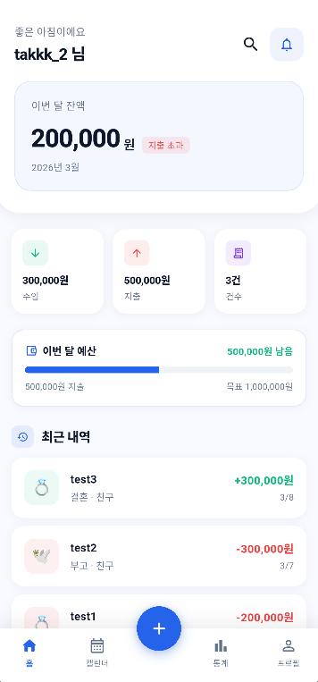
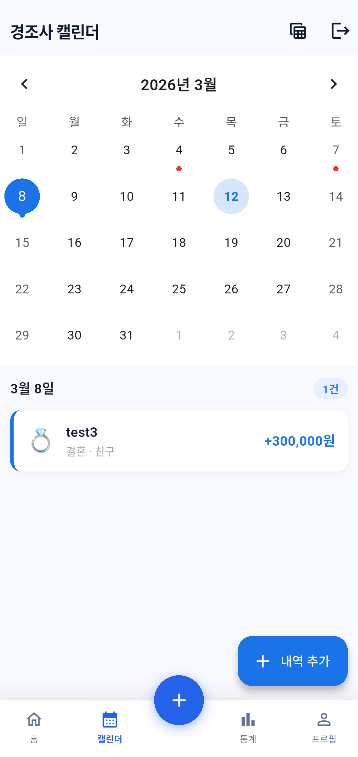
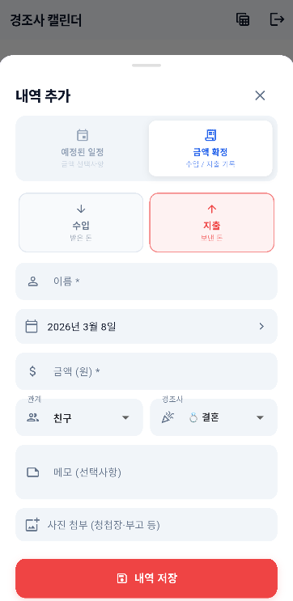
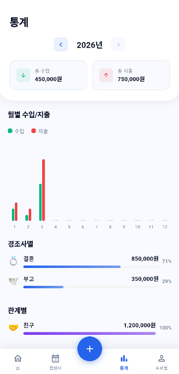

<div align="center">


# 오고가고
### 스마트한 경조사 장부

<br>

[](https://flutter.dev)
[](https://dart.dev)
[](https://firebase.google.com)
[](https://riverpod.dev)
[](./CHANGELOG.md)

<br>

> **소중한 마음을 잊지 않고 기록하세요.**
> 복잡한 경조사비 관리를 직관적이고 스마트하게 해결하는 모바일 장부 앱입니다.

</div>

<br>

---

## 📱 주요 화면

| 홈 | 캘린더 | 내역 추가 | 통계 | 프로필 |
|:---:|:---:|:---:|:---:|:---:|
|  |  |  |  |  |

<br>

---

## ✨ 핵심 기능

### 🔐 인증 & 프로필

| 기능 | 설명 |
|---|---|
| **소셜 로그인** | Google · 카카오 · 네이버 · 이메일/비밀번호 로그인 지원 |
| **프로필 설정** | 최초 로그인 시 닉네임·이름 설정 화면 자동 진입 |
| **프로필 수정** | 닉네임·이름 편집 후 Firestore 및 Firebase Auth 동기화 |
| **회원탈퇴** | Firestore 전체 데이터 삭제 후 Firebase Auth 계정 영구 삭제 |

### 📝 경조사 내역 관리

| 기능 | 설명 |
|---|---|
| **상세 기록** | 날짜 · 이름 · 관계(가족/친구/직장 등) · 경조사 종류(결혼/장례/생일 등) · 금액 · 메모 |
| **수입/지출 구분** | 받은 마음(수입)과 보낸 마음(지출)을 명확히 분리 |
| **사진 첨부** | 청첩장·부고 등 사진 첨부, 썸네일 탭으로 전체 화면 보기 (핀치줌 지원) |
| **실시간 동기화** | Cloud Firestore 기반 실시간 데이터 스트리밍 |
| **로컬 캐시** | Drift(SQLite) 로컬 DB로 오프라인에서도 데이터 접근 가능 |
| **반복 이벤트** | 매년 반복되는 경조사(생일·기념일 등) 등록 및 시각적 표시 |
| **일괄 삭제** | 장부 화면에서 다중 선택 후 한 번에 삭제 |

### 👨‍👩‍👧‍👦 가족 공유장부

| 기능 | 설명 |
|---|---|
| **그룹 생성** | 방장으로 가족 그룹 생성 및 6자리 초대코드 발급 |
| **초대코드 참여** | 방장에게 받은 코드 입력으로 즉시 그룹 합류 (최대 10명) |
| **실시간 공유** | 모든 멤버가 동일한 장부 실시간 조회 및 등록 가능 |
| **별칭 설정** | 멤버별 표시 이름 커스터마이징 |
| **멤버 추방** | 방장이 특정 멤버를 그룹에서 즉시 추방 |
| **그룹 해산** | 방장이 그룹 전체 해산 (모든 멤버 퇴장) |
| **나가기** | 일반 멤버 자유 탈퇴 (방장 나가면 소유권 자동 이전) |
| **초대코드 복사** | 초대코드 탭 한 번으로 클립보드 복사 |

### 📊 대시보드 & 통계

| 기능 | 설명 |
|---|---|
| **홈 요약** | 이번 달 수입·지출·잔액 카드 탭 시 전체 내역 상세 화면으로 이동 |
| **다가오는 경조사** | 홈 경조사 카드 탭 시 해당 내역 수정 바텀시트 바로 열기 |
| **캘린더 뷰** | 월별 달력에서 경조사 일정 한눈에 파악 |
| **통계 화면** | 연·월별 수입/지출 합계·건수·차트, 총 수입/총 지출 탭 시 상세 내역 이동 |
| **통계 공유** | 연간 결산 카드를 이미지로 캡처해 SNS·카카오톡 등으로 공유 |
| **내역 상세** | 수입·지출·전체 내역을 연도별 그룹 헤더 + 소계와 함께 표시 |
| **장부 목록** | 전체 내역 검색 및 필터링 |
| **홈 위젯** | 홈 화면 위젯에서 주요 통계 바로 확인 |
| **프로필 통계** | 총 수입·총 지출·내역 수 칩 탭 시 해당 상세 내역 화면으로 이동 |

### 🔗 연락처 연동

| 기능 | 설명 |
|---|---|
| **이름 자동완성** | 내역 등록 시 전화번호부에서 이름 검색·자동완성 |
| **생일 자동입력** | 연락처에 생일이 등록된 경우 이름 선택 시 날짜 자동 입력 |

### ⚡ 자동화 도구

| 기능 | 설명 |
|---|---|
| **엑셀 일괄 등록** | 제공된 양식에 맞춰 작성한 `.xlsx` 파일을 앱으로 업로드하면 한 번에 등록 |
| **데이터 내보내기** | PDF 보고서 또는 Excel 파일로 변환·저장·공유 |
| **백업 · 복원** | Google 드라이브 또는 로컬 파일로 데이터 백업 및 복원 |
| **카테고리 관리** | 경조사 종류 추가·편집으로 커스텀 카테고리 운영 |
| **OCR 스캔** | *(준비 중)* Google ML Kit 기반 봉투·청첩장 텍스트 자동 인식 |

### 🔔 알림

| 기능 | 설명 |
|---|---|
| **경조사 알림** | 예정된 경조사 날짜에 맞춰 로컬 푸시 알림 |
| **알림 목록** | 예약된 알림 목록 확인 및 관리 |

### ⚙️ 앱 설정

| 기능 | 설명 |
|---|---|
| **월별 예산 설정** | 월 지출 예산 설정 및 초과 경고 |
| **버전 정보** | 버전별 업데이트 날짜 및 변경사항 확인 |
| **이용약관** | 서비스 이용약관 인앱 표시 |
| **개인정보처리방침** | 개인정보 수집·이용 안내 인앱 표시 |
| **카카오톡 초대** | 친구에게 오고가고 앱 링크 카카오톡으로 공유 |

<br>

---

## 🛠️ 기술 스택

```
┌─────────────────────────────────────────────────────┐
│                    Frontend (Flutter)                │
│  ┌──────────┐  ┌──────────┐  ┌────────────────────┐ │
│  │ Riverpod │  │ Drift DB │  │   Pretendard Font  │ │
│  │  State   │  │  SQLite  │  │   Material 3 UI    │ │
│  └──────────┘  └──────────┘  └────────────────────┘ │
└─────────────────────────┬───────────────────────────┘
                          │
┌─────────────────────────▼───────────────────────────┐
│                  Backend (Firebase)                  │
│  ┌──────────────┐        ┌────────────────────────┐  │
│  │ Firebase Auth│        │   Cloud Firestore      │  │
│  │  · Google    │        │  users/{uid}/          │  │
│  │  · 카카오    │        │    profile/data        │  │
│  │  · 네이버    │        │    events/{eventId}    │  │
│  │  · 이메일    │        │  families/{familyId}/  │  │
│  └──────────────┘        │    events/{eventId}    │  │
│                          └────────────────────────┘  │
└─────────────────────────────────────────────────────┘
```

### 주요 패키지

| 분류 | 패키지 | 버전 |
|---|---|---|
| **상태 관리** | flutter_riverpod | ^2.4.9 |
| **인증** | firebase_auth | ^4.15.3 |
| **인증** | google_sign_in | ^6.2.1 |
| **인증** | kakao_flutter_sdk_user | ^1.9.1 |
| **인증** | flutter_naver_login | ^2.1.1 |
| **DB (클라우드)** | cloud_firestore | ^4.14.0 |
| **DB (로컬)** | drift + drift_flutter | ^2.14.1 |
| **캘린더** | table_calendar | ^3.0.9 |
| **차트** | fl_chart | ^0.69.0 |
| **엑셀** | excel | ^4.0.6 |
| **PDF** | pdf + printing | ^3.10.8 |
| **OCR** | google_mlkit_text_recognition | ^0.13.0 |
| **알림** | flutter_local_notifications | ^17.2.2 |
| **홈 위젯** | home_widget | ^0.6.0 |
| **연락처** | flutter_contacts | ^1.1.7+1 |
| **파일** | file_picker + open_file | ^8.1.2 |
| **공유** | share_plus | ^7.2.1 |
| **카카오 공유** | kakao_flutter_sdk_share | ^1.9.1 |

<br>

---

## 📂 프로젝트 구조

```
lib/
├── main.dart                     # 앱 진입점, Firebase 초기화, 라우팅
├── firebase_options.dart         # Firebase 프로젝트 설정
│
├── models/
│   ├── event_model.dart          # 경조사 내역 모델 (EventModel, RelationType, CeremonyType 등)
│   ├── family_model.dart         # 가족 그룹 모델 (FamilyModel, 멤버/별칭 관리)
│   ├── notification_settings.dart # 알림 설정 모델
│   └── user_profile.dart         # 사용자 프로필 모델 (UserProfile)
│
├── providers/
│   ├── auth_provider.dart        # 인증 상태 관리 (AuthNotifier, userProfileProvider)
│   ├── budget_provider.dart      # 예산 관리 Provider
│   ├── contact_provider.dart     # 연락처 이름 목록 + 생일 자동완성 Provider
│   ├── event_provider.dart       # 이벤트 CRUD 및 통계 (EventNotifier, ledgerSummaryProvider)
│   ├── family_provider.dart      # 가족 그룹 실시간 스트림 Provider
│   └── notification_settings_provider.dart # 알림 설정 Provider
│
├── services/
│   ├── auth_service.dart         # Firebase Auth + 소셜 로그인 + 회원탈퇴
│   ├── profile_service.dart      # Firestore 프로필 CRUD
│   ├── firestore_service.dart    # Firestore 개인 이벤트 CRUD
│   ├── family_service.dart       # 가족 그룹 CRUD (생성/참여/추방/해산/공유장부)
│   ├── db_service.dart           # Drift 로컬 SQLite
│   ├── export_service.dart       # Excel/PDF 내보내기
│   ├── excel_template_service.dart # 엑셀 양식 생성
│   ├── pdf_report_service.dart   # PDF 보고서 생성
│   ├── notification_service.dart # 로컬 푸시 알림
│   ├── notification_settings_service.dart # 알림 설정 관리
│   ├── kakao_share_service.dart  # 카카오톡 앱 초대 공유
│   └── home_widget_service.dart  # 홈 위젯 업데이트
│
└── views/
    ├── auth/
    │   ├── login_screen.dart         # 로그인 화면 (소셜 + 이메일)
    │   └── profile_setup_screen.dart # 최초 프로필 설정 화면
    ├── home/
    │   ├── main_nav_screen.dart      # 하단 네비게이션 (홈/캘린더/장부/통계/프로필)
    │   ├── home_screen.dart          # 홈 화면 (최근 내역, 월 요약, 이번달 잔액)
    │   └── stats_screen.dart         # 통계 화면 (차트 + 연간 결산 이미지 공유)
    ├── calendar/
    │   ├── calendar_screen.dart      # 캘린더 뷰
    │   ├── event_bottom_sheet.dart   # 내역 등록/수정 바텀시트 (연락처 자동완성 + 생일 자동입력)
    │   └── ocr_register_screen.dart  # OCR 스캔 화면 (준비 중)
    ├── ledger/
    │   └── ledger_screen.dart        # 장부 목록 화면 (다중 선택 삭제)
    ├── search/
    │   └── search_screen.dart        # 검색 화면
    ├── export/
    │   ├── excel_import_screen.dart  # 엑셀 일괄 등록
    │   └── export_screen.dart        # 데이터 내보내기
    ├── notifications/
    │   └── notification_screen.dart  # 알림 목록
    ├── person/
    │   └── person_history_screen.dart # 인물별 경조사 내역
    ├── settings/
    │   ├── backup_screen.dart        # 백업 · 복원
    │   ├── budget_setting_screen.dart # 월별 예산 설정
    │   └── category_settings_screen.dart # 카테고리 커스텀 관리
    ├── profile/
    │   ├── profile_screen.dart       # 프로필 탭 메인 (총 수입/지출/내역 수 칩 → 상세 이동)
    │   ├── profile_stats_screen.dart # 수입·지출·전체 내역 상세 (연도별 그룹핑)
    │   ├── family_share_screen.dart  # 가족 공유장부 (그룹 생성/참여/멤버 관리/추방)
    │   ├── profile_edit_screen.dart  # 닉네임/이름 수정
    │   ├── version_info_screen.dart  # 버전 정보 & 업데이트 내역
    │   └── legal_screen.dart         # 이용약관 / 개인정보처리방침
    └── common/
        └── app_theme.dart            # 앱 전체 테마 (색상, 폰트, 컴포넌트)
```

<br>

---

## 🚀 시작하기

### 사전 요구사항

- Flutter 3.x 이상
- Dart 3.x 이상
- Firebase 프로젝트 (Auth + Firestore)
- 카카오 개발자 앱 등록
- 네이버 개발자 앱 등록

---

### 1. 저장소 클론

```bash
git clone https://github.com/LimJongTak/ceremonial-ledger.git
cd ceremonial-ledger
```

### 2. 패키지 설치

```bash
flutter pub get
```

### 3. Firebase 설정

1. [Firebase Console](https://console.firebase.google.com)에서 프로젝트 생성
2. Android 앱 등록 → `google-services.json`을 `android/app/`에 배치
3. **Authentication** → 로그인 방법 → 이메일/비밀번호 · Google 활성화
4. **Firestore Database** 생성 후 아래 보안 규칙 적용

```javascript
// firestore.rules
rules_version = '2';
service cloud.firestore {
  match /databases/{database}/documents {
    // 개인 데이터: 본인만 접근
    match /users/{userId}/{document=**} {
      allow read, write: if request.auth != null
                        && request.auth.uid == userId;
    }
    // 프로필 닉네임: 가족 멤버 이름 표시를 위해 인증 사용자 읽기 허용
    match /users/{userId}/profile/data {
      allow read: if request.auth != null;
    }
    // 가족 공유장부
    match /families/{familyId} {
      allow get: if request.auth != null &&
        request.auth.uid in resource.data.memberIds;
      allow list: if request.auth != null;
      allow create: if request.auth != null &&
        request.auth.uid in request.resource.data.memberIds;
      allow update: if request.auth != null && (
        request.auth.uid in resource.data.memberIds ||
        request.auth.uid in request.resource.data.memberIds
      );
      allow delete: if request.auth != null &&
        request.auth.uid in resource.data.memberIds;
      match /events/{eventId} {
        allow read, write: if request.auth != null &&
          request.auth.uid in
            get(/databases/$(database)/documents/families/$(familyId)).data.memberIds;
      }
    }
  }
}
```

### 4. 소셜 로그인 설정

#### 카카오 로그인
1. [카카오 개발자 콘솔](https://developers.kakao.com) → 앱 생성
2. **앱 키 → 네이티브 앱 키** 복사 → `lib/main.dart`의 `KakaoSdk.init(appKey: ...)` 값 교체
3. **플랫폼 → Android** → 패키지명 `com.yourcompany.ceremonial_ledger`, 키 해시 등록
4. **카카오 로그인 → 활성화** 및 **Redirect URI** 설정: `kakao{네이티브앱키}://oauth`

```bash
# 디버그 키 해시 생성 (Windows)
keytool -exportcert -alias androiddebugkey -keystore %USERPROFILE%\.android\debug.keystore | openssl sha1 -binary | openssl base64
```

#### 네이버 로그인
1. [네이버 개발자 센터](https://developers.naver.com) → 앱 등록 → **네이버 로그인** API 선택
2. Android 패키지명 등록 후 `Client ID` / `Client Secret` 확인
3. `android/app/src/main/res/values/strings.xml` 값 교체:

```xml
<resources>
  <string name="naver_client_id">여기에_클라이언트_ID</string>
  <string name="naver_client_secret">여기에_클라이언트_시크릿</string>
  <string name="naver_client_name">오고가고</string>
</resources>
```

### 5. 앱 실행

```bash
flutter run
```

### 6. (선택) 앱 아이콘 및 스플래시 재생성

```bash
dart run flutter_launcher_icons
dart run flutter_native_splash:create
```

<br>

---

## 🗺️ 앱 플로우

```
앱 실행
  └─ 스플래시
       └─ 로그인 여부 확인
            ├─ 미로그인 → 로그인 화면 (Google / 카카오 / 네이버 / 이메일)
            │                └─ 최초 로그인 → 프로필 설정 화면 (닉네임 입력)
            └─ 로그인됨 → 메인 화면 (하단 탭 네비게이션)
                              ├─ 홈       : 최근 내역 + 이번달 수입/지출/잔액
                              ├─ 캘린더   : 달력 뷰 + 내역 등록/수정 + 연락처 자동완성
                              ├─ 장부     : 전체 목록 + 검색 + 일괄 삭제
                              ├─ 통계     : 월별/연별 차트 + 연간 결산 이미지 공유
                              └─ 프로필   : 계정 관리 + 가족 공유장부 + 데이터 관리 + 앱 정보
                                                ├─ 가족 공유장부
                                                │     ├─ 그룹 없음 → 생성 또는 코드로 참여
                                                │     └─ 그룹 있음 → 공유 장부 + 멤버 목록
                                                │                       ├─ 방장: 멤버 추방 / 그룹 해산
                                                │                       └─ 멤버: 그룹 나가기
                                                ├─ 백업 · 복원
                                                ├─ 카테고리 관리
                                                └─ 월별 예산 설정
```

<br>

---

## 📋 버전 내역

| 버전 | 출시일 | 주요 변경사항 |
|---|---|---|
| **v1.3.0** | 2026년 3월 | 연락처 생일 자동입력, 통계 연간 결산 이미지 공유, 장부 일괄 삭제, 반복 이벤트 시각화, 카테고리 커스텀 관리, 백업·복원, 카카오톡 초대 |
| **v1.2.0** | 2026년 3월 | 수입·지출·내역 상세 화면 (연도별 그룹핑), 홈·통계·프로필 통계 카드 탭 내비게이션 연동, 홈 경조사 카드 탭으로 내역 수정, 어댑티브 앱 아이콘 적용 |
| **v1.1.0** | 2026년 3월 | 가족 공유장부 (그룹 생성/참여/추방/해산), 사진 전체 화면 보기, 알림 설정 커스터마이징 |
| **v1.0.0** | 2025년 3월 | 최초 출시 — 경조사 기록, 소셜 로그인, 캘린더, 통계, 엑셀 가져오기/내보내기, 홈 위젯, 알림, 프로필 수정, 회원탈퇴 |

<br>

---

## 🔒 보안 및 개인정보

- 모든 사용자 데이터는 Firebase Auth UID 기반으로 격리 저장
- Firestore 보안 규칙으로 본인 데이터 및 가족 그룹 멤버 데이터만 접근 가능
- 가족 그룹 추방/해산은 방장만 실행 가능하며 서버 측에서 이중 검증
- 소셜 로그인 시 외부 서버에 비밀번호 미전송
- 회원탈퇴 시 Firestore 데이터 즉시 일괄 삭제

<br>

---

## 📄 라이선스

이 프로젝트는 비공개(Private) 프로젝트입니다.
무단 복제 및 배포를 금지합니다.

---

<div align="center">

**오고가고** · ⓒ 2026 All rights reserved.

</div>
